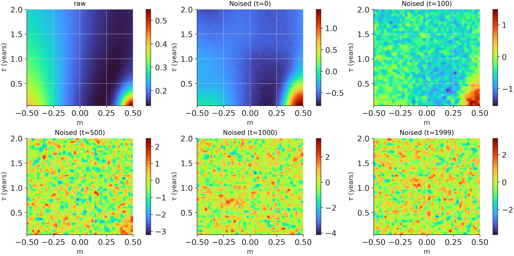
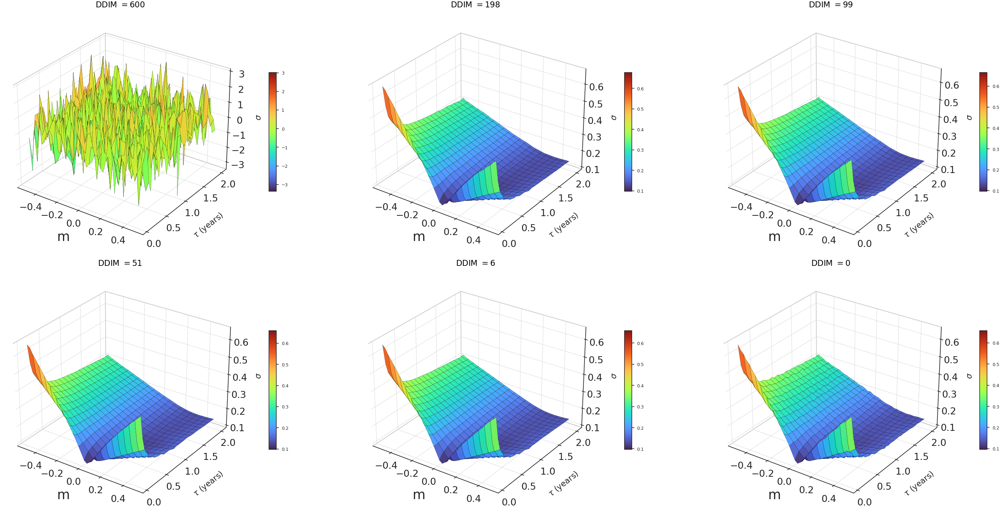
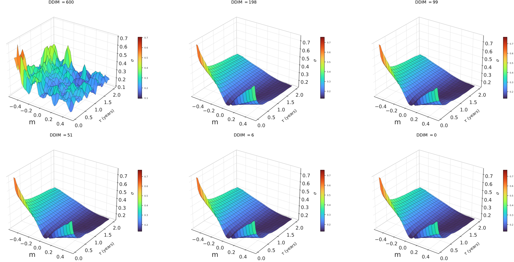
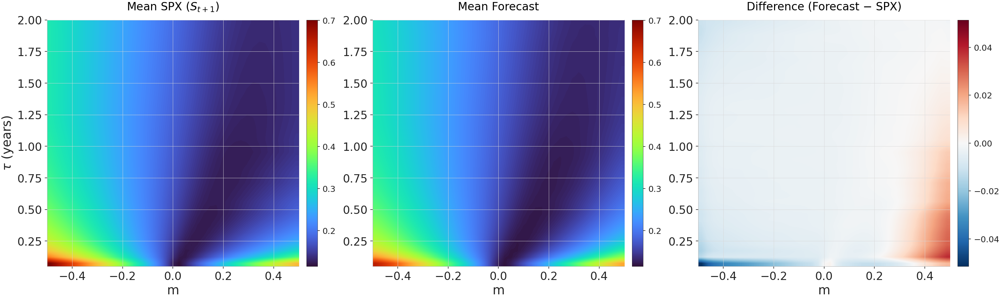
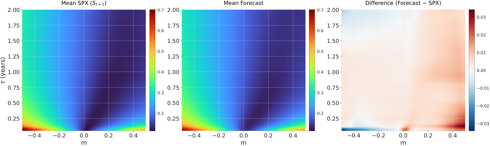

# Implied Volatility Diffusion

Modelling implied-volatility surfaces (IVS) with conditional diffusion models. U-Net and transformer denoisers, optional VQ-VAE latent encoding, DDIM sampling, Heston/SABR synthetic surfaces, and no-arbitrage diagnostics.

## Forward process

VP forward process on the SPX IVS from 2023-05-11, in normalized log-IV space. Left is the clean surface; right is pure Gaussian noise at $t = T = 600$.



## Generation

DDIM reverse process — from noise back to a generated IV surface.

**U-Net (raw log-IV space)**



**U-Net + VQ-VAE (quantized latent)**



## Visual validation

Conditional one-day forecast on historical SPX surfaces. Columns: mean market surface, mean generated surface, residual.

**U-Net**



**U-Net with VQ-VAE**



## Architecture

[](assets/syst_diag.svg)

## Installation

```bash
uv sync
uv sync --group notebooks
```

```bash
uv run pytest
uv run pre-commit run --all-files
```

## Layout

| Path | What's inside |
|---|---|
| `src/implied_volatility_diffusion/` | models, pricing, synthetic surfaces, data utils |
| `config/` | YAML configs for surface generation and shared grids |
| `notebooks/` | research notebooks — `data/`, `synthetic/`, `training/`, `validation/`, `diagnostics/` |
| `data/` | raw and processed datasets |
| `docs/` | technical writeups |

## Docs

- [Heston surface generation](docs/heston_surface_generation.md)
- [SABR surface generation](docs/sabr_surface_generation.md)
- [Option data pipeline](docs/option_data_pipeline.md)
- [SABR interpolation](docs/sabr_interpolation.md)
